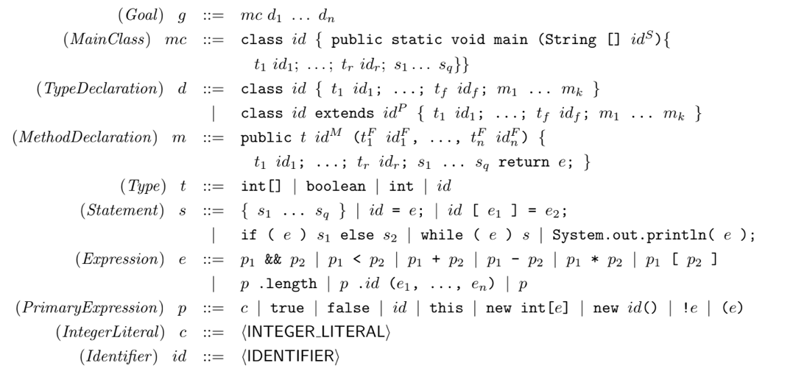

# Java Compiler

## Table of Contents

- [Introduction](#introduction)
- [System Requirements](#system-requirements)
- [Installation](#installation)
- [Usage](#usage)
- [Examples](#examples)
- [Credit](#credit)

## Introduction
Welcome! This java compiler can compile a subset of java code to RISC-V architecture. Let's get started!

## System requirements

- Gradle 8.1 or higher
- JDK 16 or higher

## Installation

1. Clone the git repo
2. Run `./gradlew build`
3. The compiler JAR artifact will be located at `compiler/build/libs/java-compiler-1.0.jar`

## Usage

`java -jar java-compiler-1.0 -f file.java`

The compiler can currently only take in a single Java file, however the single file may contain multiple classes. 

The output for an input file `file.java` will be located in the same directory as the file and will be called `file.v`

The input Java program must adhere to the following supported grammar:

Running the resultant RISC-V code can be done on the [online Venus compiler](https://chocopy.org/venus).

## Examples

Try out some of the examples located in the `examples/` directory!

## Credit

1. The `cs132.jar` contains useful code for parsing input code and intermediate code as well as for traversing the resultant parse tree.
The source code for the JAR can be found [here](https://github.com/ShuyangLiu/cs132-lib/tree/master).
2. The project idea and input grammar specification is credited to the UCLA Computer Science department.